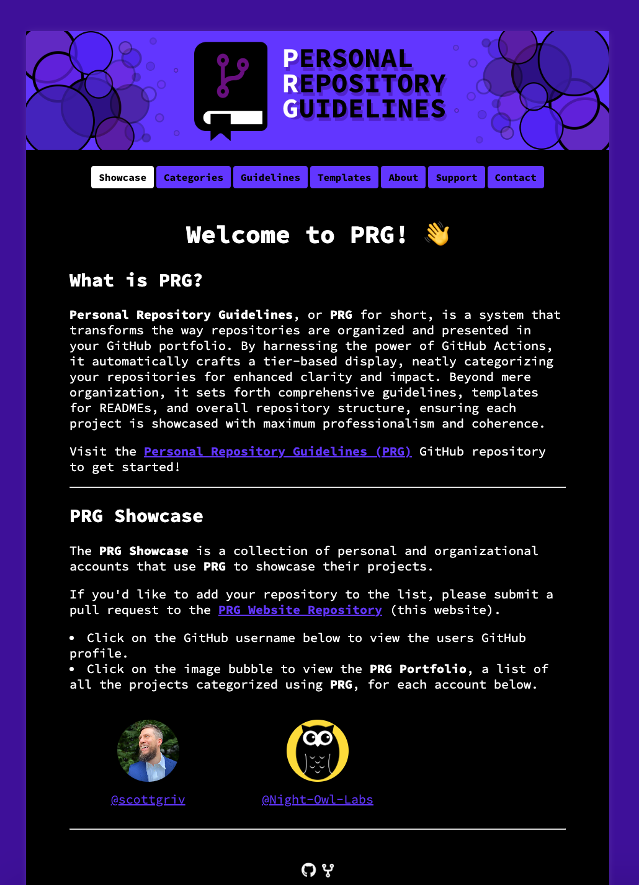
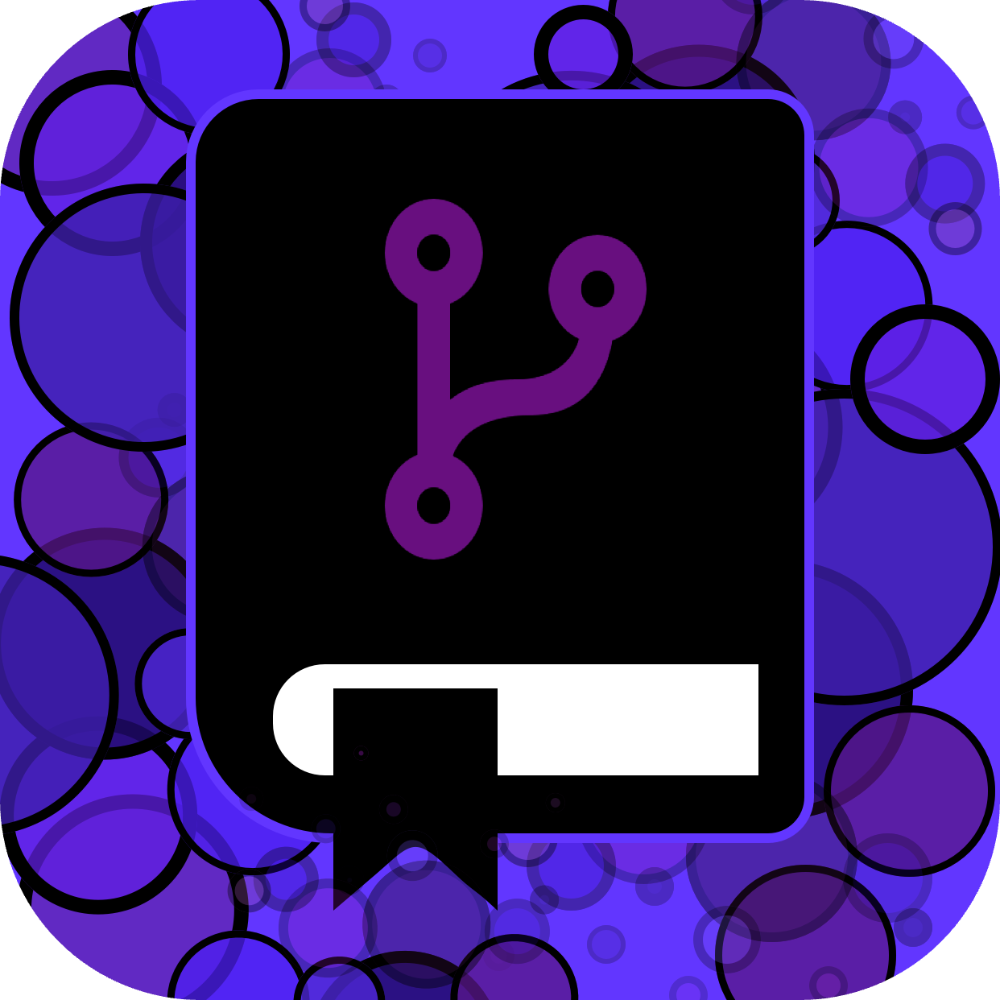

<!-- Begin README -->

[](https://prgoptimized.com)

<p align="center">
    <a href="https://www.gatsbyjs.com/"></a>
    <a href="https://react.dev/"></a>
    <a href="https://www.netlify.com/"></a>
    <a href="https://graphql.org/"></a>
    <br>
    <a href="https://github.com/scottgriv"></a>
    <a href="mailto:scott.grivner@gmail.com"></a>
    <a href="https://www.buymeacoffee.com/scottgriv"></a>
    <br>
    <a href="https://github.com/scottgriv/PRG-Personal-Repository-Guidelines/releases" target="_blank"></a>
    <a href="https://prgoptimized.com" target="_blank">
    
    </a>
    <a href="https://prgportfolio.com"></a>
</p>

--------------- 

<h1 align="center">The Official Website for PRG</h1>

<p align="center">
    <a href="https://app.netlify.com/sites/beeheard/deploys"></a>
</p>

Welcome to the Official Website for **PRG**. 

What is **PRG** you ask? **Personal Repository Guidelines**, or **PRG** for short, is a system that transforms the way repositories are organized and presented in your GitHub portfolio. By harnessing the power of GitHub Actions, it automatically crafts a tier-based display, neatly categorizing your repositories for enhanced clarity and impact. Beyond mere organization, it sets forth comprehensive guidelines, templates for READMEs, and overall repository structure, ensuring each project is showcased with maximum professionalism and coherence.

Visit the [Personal Repository Guidelines (PRG)](https://github.com/scottgriv/PRG-Personal-Repository-Guidelines) GitHub repository to get started!

If you would like to showcase your GitHub portfolio using **PRG** on the PRG Website, please feel free to fork this repository and submit a pull request with your changes (details in the [Getting Started](#getting-started) section below).
- Visit the Official PRG Website [here](https://prgoptimized.com).

<div align="center">
    <a href="https://prgoptimized.com" target="_blank">
        
    </a>
    <br>
    <i>Add your PRG Portfolio to the Showcase!</i>
</div>

---------------

## Table of Contents

- [Getting Started](#getting-started)
- [Closing](#closing)
- [License](#license)
- [Credits](#credits)

## Getting Started

1. To get started, fork this repository to your own GitHub account. You can do this by clicking the **Fork** button in the upper right-hand corner of this page.
2. Once you have forked the repository, open up the project in your favorite IDE. I would recommend [Visual Studio Code](https://code.visualstudio.com/).
3. Open up the `static/showcase` folder and create a new folder with your GitHub username.
4. Inside your new folder, create a new file called `showcase.md` and add the following code:

```markdown
---
githubUsername: "[YOUR_GITHUB_USERNAME]"
githubURL: "https://[YOUR_GITHUB_PROFILE_URL]"
prgPortfolioURL: "https://[YOUR_PRG_PORTFOLIO_URL]"
date: [TODAY'S_DATE]
---
```

An example of this can be seen in the `static/showcase/scottgriv` folder:
```markdown
---
githubUsername: "scottgriv"
githubURL: "https://github.com/scottgriv"
prgPortfolioURL: "https://prgoptimized.com"
date: "2023-12-09"
---
```

That's it! You have now created your PRG Portfolio to be Showcased on the PRG Website, GraphQL will do the rest!

5. Optionally, you can add a photo to be displayed on the showcase page. To do this, add a photo to the `static/showcase/[YOUR_GITHUB_USERNAME]` folder and name it `[YOUR_GITHUB_USERNAME]-showcase.png` or `.jpg`. The photo should be a square image. An example of this can be seen in the `static/showcase/scottgriv` folder.

```markdown
For example:
scottgriv-showcase.png
or 
scottgriv-showcase.jpg
are both acceptable
```

6. Once you have completed these steps, you can submit a pull request to the main branch of this repository. If you are unfamiliar with this process, please see the [GitHub Docs](https://docs.github.com/en/github/collaborating-with-issues-and-pull-requests/creating-a-pull-request-from-a-fork).
7. Once your pull request has been approved and merged, your PRG Portfolio will be added to the showcase page of the PRG Website! You can view the showcase page [here](https://prgoptimized.com/showcase).

> [!NOTE]
> If you would like to make any changes to your PRG Portfolio, simply make the changes to your forked repository and submit another pull request. Your changes will be reflected on the PRG Website once the pull request has been approved and merged.

> [!WARNING]
> You should not make any other changes other than adding your PRG Portfolio to the showcase page (and any Organization's you're apart of that utilize PRG). Any other changes will be rejected.

## Closing

Thank you for using **PRG**! I hope you find it useful. If you have any questions, comments, or suggestions, please feel free to reach out to me. I would love to hear from you!

If you like this website and want to use it as a template for your own, I would suggest visiting the source of this website, another project I made specifically for my business website, [here](https://github.com/scottgriv/Business-Website). It is a more robust version of this website, with more features and functionality; the README is also more detailed and comprehensive. The finished product can be viewed at [nightowllabs.io](https://nightowllabs.io).

## License

This project is released under the terms of the **MIT License**, which permits use, modification, and distribution of the code, subject to the conditions outlined in the license.
- The [MIT License](https://choosealicense.com/licenses/mit/) provides certain freedoms while preserving rights of attribution to the original creators.
- For more details, see the [LICENSE](LICENSE) file in this repository. in this repository.

## Credits

**Author:** [Scott Grivner](https://github.com/scottgriv) <br>
**Email:** [scott.grivner@gmail.com](mailto:scott.grivner@gmail.com) <br>
**Website:** [scottgrivner.dev](https://www.scottgrivner.dev) <br>
**Reference:** [Main Branch](https://github.com/scottgriv/PRG-Website) <br>

---------------

<div align="center">
    <a href="https://github.com/scottgriv/PRG-Website" target="_blank">
        
    </a>
</div>

<!-- End README -->
